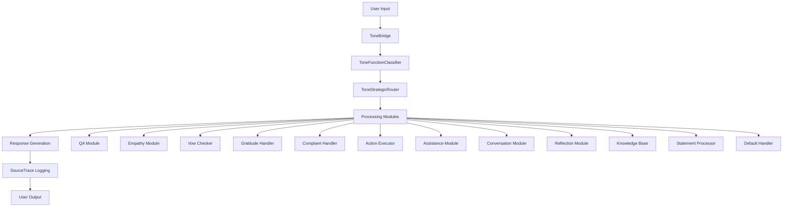
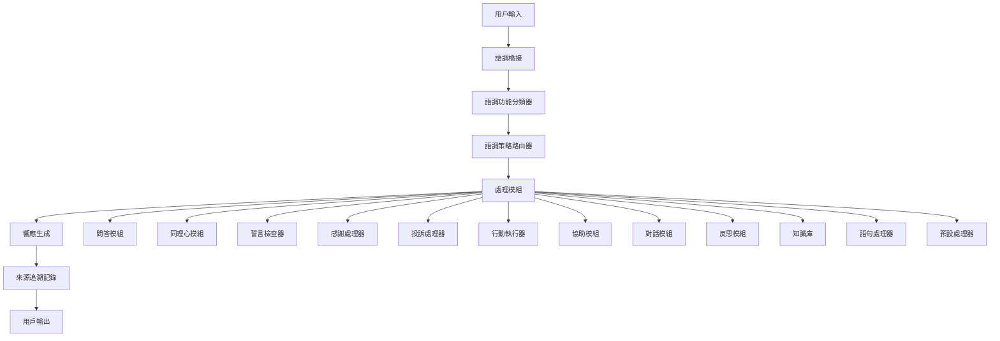

# ToneSoul System Architecture | 系統架構

[English](#english) | [中文](#中文)

---

## English

### System Overview

ToneSoul System is designed as a modular, pipeline-based AI processing framework that combines emotional intelligence with moral memory capabilities. The system processes natural language inputs through a series of specialized components, each responsible for a specific aspect of understanding and response generation.

### Core Architecture



### Component Details

#### 1. ToneBridge (Perception Layer)
- **Purpose**: Initial perception and analysis of user input
- **Responsibilities**:
  - Text preprocessing and normalization
  - Basic sentiment analysis
  - Context extraction
  - Trace initialization

#### 2. ToneFunctionClassifier (Understanding Layer)
- **Purpose**: Classify user intent and determine appropriate processing function
- **Functions Supported**:
  - `QUESTION`: Information seeking queries
  - `GRATITUDE`: Expressions of thanks
  - `COMPLAINT`: Negative feedback or complaints
  - `CASUAL_CHAT`: General conversation
  - `VOW_DECLARATION`: Moral commitments or promises
  - `ASSISTANCE_REQUEST`: Requests for help
  - `ACTION_REQUEST`: Requests for specific actions
  - `REFLECTION_REQUEST`: Requests for self-reflection
  - `UNKNOWN`: Unclassified inputs

#### 3. ToneStrategicRouter (Decision Layer)
- **Purpose**: Route classified inputs to appropriate processing modules
- **Routing Logic**:
  - Confidence-based routing
  - Fallback mechanisms
  - Module availability checking
  - Load balancing (future feature)

#### 4. Processing Modules (Execution Layer)

##### Core Modules:
- **QAModule**: Handles question-answering scenarios
- **EmpathyModule**: Provides emotional understanding and support
- **VowChecker**: Processes and validates moral commitments
- **GratitudeHandlerModule**: Manages gratitude expressions
- **ComplaintHandlerModule**: Handles complaints and negative feedback

##### Support Modules:
- **ActionExecutorModule**: Executes specific requested actions
- **AssistanceModule**: Provides general assistance
- **ConversationModule**: Manages casual conversations
- **ReflectionModule**: Handles self-reflection requests
- **KnowledgeBaseModule**: Accesses and retrieves knowledge
- **StatementProcessorModule**: Processes general statements
- **DefaultHandlerModule**: Fallback for unhandled cases

### Data Models

#### SourceTrace Protocol
```python
class SourceTrace:
    id: str                    # Unique trace identifier
    steps: List[TraceStep]     # Chronological processing steps

class TraceStep:
    tool: str                  # Processing tool/module name
    status: TraceStatus        # SUCCESS or FAIL
    input_digest: str | None   # SHA256 hash for verification
    evidence: str              # Processing evidence/logs
    trust_level: TrustLevel    # A, B, or C trust classification
    latency_ms: int           # Processing time in milliseconds
    ts: datetime              # Timestamp
```

#### VowObject System
```python
class VowObject:
    id: str                           # Unique vow identifier
    commitment: str                   # The actual commitment
    original_sentence: str            # Original user input
    scope: List[str]                 # Applicable contexts
    status: VowStatus                # ACTIVE, FULFILLED, WITHDRAWN, etc.
    priority: VowPriority            # CRITICAL, HIGH, MEDIUM, LOW
    created_at: datetime             # Creation timestamp
    deadline: Optional[datetime]      # Optional deadline
    withdrawal: WithdrawalConditions  # Conditions for withdrawal
    source_trace_id: str             # Associated trace
    confidence_score: float          # Parsing confidence
```

### Processing Flow

1. **Input Reception**: User input received via API
2. **Perception**: ToneBridge analyzes and preprocesses input
3. **Classification**: ToneFunctionClassifier determines intent
4. **Routing**: ToneStrategicRouter selects appropriate module
5. **Processing**: Selected module processes the input
6. **Response Generation**: Module generates appropriate response
7. **Trace Logging**: Complete processing chain logged
8. **Output Delivery**: Response returned to user

### Security Considerations

- **Input Validation**: All inputs validated using Pydantic models
- **Audit Trail**: Complete processing history maintained
- **Error Handling**: Graceful degradation on failures
- **Type Safety**: Strong typing throughout the system

### Scalability Features

- **Modular Design**: Easy to add new processing modules
- **Async Support**: Non-blocking processing capabilities
- **Stateless Processing**: Each request processed independently
- **Horizontal Scaling**: API can be scaled across multiple instances

### Monitoring and Observability

- **Structured Logging**: Comprehensive logging throughout
- **Performance Metrics**: Latency tracking for all operations
- **Health Checks**: System health monitoring endpoints
- **Trace Analysis**: Complete audit trail for debugging

---

## 中文

### 系統概述

語魂系統設計為模組化、基於管道的 AI 處理框架，結合情感智能和道德記憶能力。系統通過一系列專門組件處理自然語言輸入，每個組件負責理解和響應生成的特定方面。

### 核心架構



### 組件詳細說明

#### 1. ToneBridge (感知層)
- **目的**: 用戶輸入的初始感知和分析
- **職責**:
  - 文本預處理和標準化
  - 基本情感分析
  - 上下文提取
  - 追溯初始化

#### 2. ToneFunctionClassifier (理解層)
- **目的**: 分類用戶意圖並確定適當的處理功能
- **支援的功能**:
  - `QUESTION`: 資訊尋求查詢
  - `GRATITUDE`: 感謝表達
  - `COMPLAINT`: 負面反饋或投訴
  - `CASUAL_CHAT`: 一般對話
  - `VOW_DECLARATION`: 道德承諾或誓言
  - `ASSISTANCE_REQUEST`: 協助請求
  - `ACTION_REQUEST`: 特定行動請求
  - `REFLECTION_REQUEST`: 自我反思請求
  - `UNKNOWN`: 未分類輸入

#### 3. ToneStrategicRouter (決策層)
- **目的**: 將分類的輸入路由到適當的處理模組
- **路由邏輯**:
  - 基於信心度的路由
  - 回退機制
  - 模組可用性檢查
  - 負載平衡（未來功能）

#### 4. 處理模組 (執行層)

##### 核心模組:
- **QAModule**: 處理問答場景
- **EmpathyModule**: 提供情感理解和支持
- **VowChecker**: 處理和驗證道德承諾
- **GratitudeHandlerModule**: 管理感謝表達
- **ComplaintHandlerModule**: 處理投訴和負面反饋

##### 支援模組:
- **ActionExecutorModule**: 執行特定請求的行動
- **AssistanceModule**: 提供一般協助
- **ConversationModule**: 管理休閒對話
- **ReflectionModule**: 處理自我反思請求
- **KnowledgeBaseModule**: 訪問和檢索知識
- **StatementProcessorModule**: 處理一般語句
- **DefaultHandlerModule**: 未處理情況的回退

### 資料模型

#### SourceTrace 協議
```python
class SourceTrace:
    id: str                    # 唯一追溯標識符
    steps: List[TraceStep]     # 按時間順序的處理步驟

class TraceStep:
    tool: str                  # 處理工具/模組名稱
    status: TraceStatus        # SUCCESS 或 FAIL
    input_digest: str | None   # 用於驗證的 SHA256 雜湊
    evidence: str              # 處理證據/日誌
    trust_level: TrustLevel    # A、B 或 C 信任分類
    latency_ms: int           # 處理時間（毫秒）
    ts: datetime              # 時間戳
```

#### VowObject 系統
```python
class VowObject:
    id: str                           # 唯一誓言標識符
    commitment: str                   # 實際承諾
    original_sentence: str            # 原始用戶輸入
    scope: List[str]                 # 適用上下文
    status: VowStatus                # ACTIVE、FULFILLED、WITHDRAWN 等
    priority: VowPriority            # CRITICAL、HIGH、MEDIUM、LOW
    created_at: datetime             # 創建時間戳
    deadline: Optional[datetime]      # 可選截止日期
    withdrawal: WithdrawalConditions  # 撤回條件
    source_trace_id: str             # 關聯追溯
    confidence_score: float          # 解析信心度
```

### 處理流程

1. **輸入接收**: 通過 API 接收用戶輸入
2. **感知**: ToneBridge 分析和預處理輸入
3. **分類**: ToneFunctionClassifier 確定意圖
4. **路由**: ToneStrategicRouter 選擇適當模組
5. **處理**: 選定模組處理輸入
6. **響應生成**: 模組生成適當響應
7. **追溯記錄**: 記錄完整處理鏈
8. **輸出交付**: 將響應返回給用戶

### 安全考慮

- **輸入驗證**: 使用 Pydantic 模型驗證所有輸入
- **審計軌跡**: 維護完整的處理歷史
- **錯誤處理**: 失敗時優雅降級
- **類型安全**: 整個系統的強類型

### 可擴展性功能

- **模組化設計**: 易於添加新的處理模組
- **異步支援**: 非阻塞處理能力
- **無狀態處理**: 每個請求獨立處理
- **水平擴展**: API 可跨多個實例擴展

### 監控和可觀察性

- **結構化日誌**: 全面的日誌記錄
- **性能指標**: 所有操作的延遲追蹤
- **健康檢查**: 系統健康監控端點
- **追溯分析**: 用於調試的完整審計軌跡